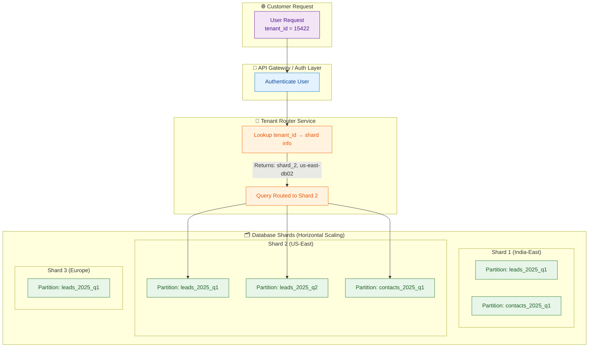

# 🧭 Multi-Tenant SaaS Database Architecture (Zoho CRM Style)



### 🧩 Explanation

1. **Client Request:**  
    The user’s request includes a `tenant_id`.
    
2. **Gateway Layer:**  
    Authenticates the user and forwards the request to the Tenant Router.
    
3. **Tenant Router Service:**
    
    - Maintains a mapping of each tenant to its shard.
        
    - Example:
        ``` 
        tenant_id | shard_id | db_host
		-----------|-----------|---------
		15422 | shard_2 | us-east-db02.zoho.com
        ```
        
        
    - Returns shard info to the backend.
        
4. **Shard Layer:**
    
    - Each shard is a separate database or cluster.
        
    - Within each shard, data is **partitioned** (by date, module, etc.) for performance.
        
5. **Query Execution:**
    
    - The backend connects directly to that shard’s DB.
        
    - Queries only relevant partitions.
        

---

### ⚡ Benefits

- **Scalable:** Each shard holds only a subset of tenants.
    
- **Efficient:** Partitions speed up local queries.
    
- **Isolated:** If one shard goes down, others stay unaffected.
    
- **Flexible:** Easy to add new shards or move tenants between shards.